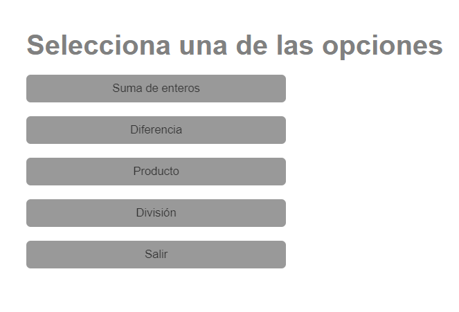
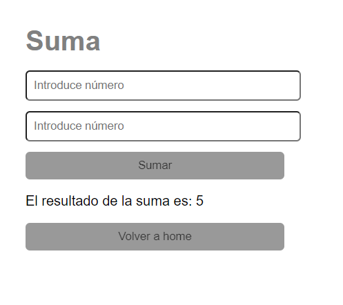
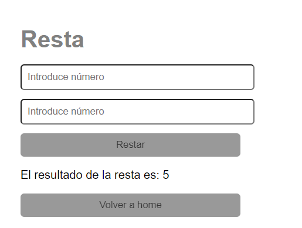
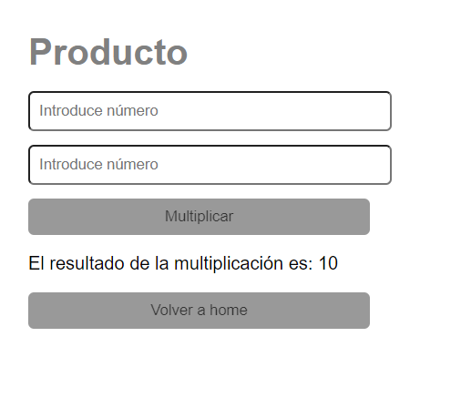
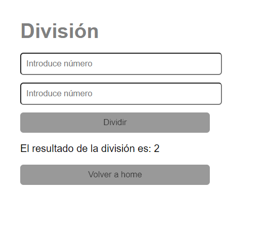
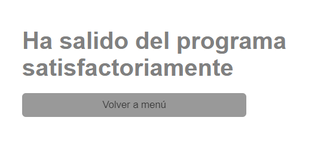

# EJERCICIO PROGRAMA CON MENÚ DE OPCIONES CURSO PROGRAMACIÓN CON SOFTWARE LIBRE

## Tecnologías:
Php, Apache

## Descripción: Menú de opciones de cálculo, al pulsar exit se sale del menú y permite volver a él. Permite en todas las opciones volver al menú.

### Menú

### Opción suma

### Opción resta

### Opción multiplicación

### Opción división

### Opción salir
